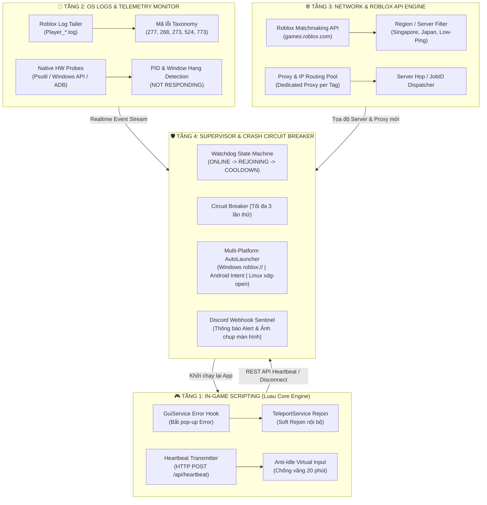
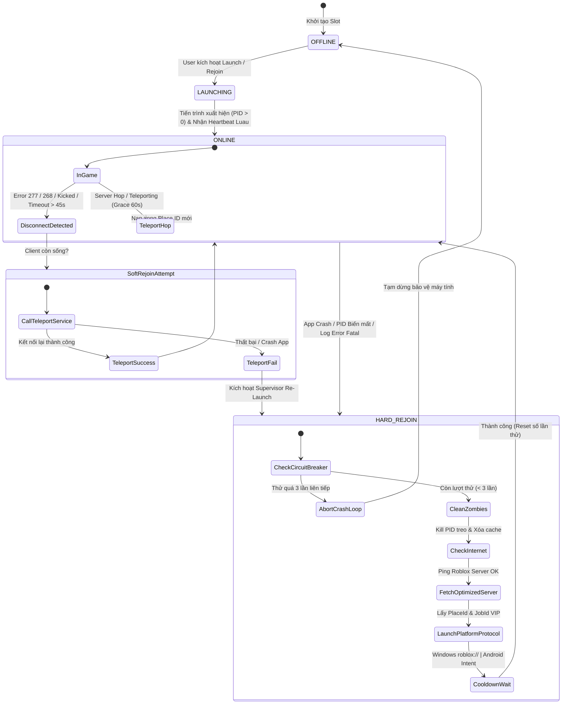

# 🛰️ TÀI LIỆU THIẾT KẾ KỸ THUẬT: HỆ THỐNG ROBLOX AUTO-REJOIN ĐA NỀN TẢNG (4-TIER ARCHITECTURE)

> **Phiên bản:** 2.5.0  
> **Hệ thống mục tiêu:** Windows 10/11 (PC), Android (Native & Cloud UGPhone), Linux Desktop, iOS/iPadOS  
> **Ngôn ngữ sử dụng:** Python 3.10+, Luau (Roblox Client/Server Engine), C/C++ Native ABI Probes, Java/ADB Bridge  

---

## 📑 MỤC LỤC
1. [Tổng Quan Kiến Trúc 4 Tầng](#1-tổng-quan-kiến-trúc-4-tầng)
2. [Sơ Đồ Luồng Hoạt Động & Máy Trạng Thái (State Machine)](#2-sơ-đồ-luồng-hoạt-động--máy-trạng-thái-state-machine)
3. [Phân Tích Chi Tiết Từng Phân Tầng Kỹ Thuật](#3-phân-tích-chi-tiết-từng-phân-tầng-kỹ-thuật)
   - 3.1. Tầng 1: Luau Client Hooks & Soft Rejoin
   - 3.2. Tầng 2: OS Process & Log Telemetry Prober
   - 3.3. Tầng 3: Roblox Matchmaking & Proxy Routing
   - 3.4. Tầng 4: Supervisor & Circuit Breaker
4. [Ma Trận Xử Lý Mã Lỗi Roblox (Error Taxonomy Matrix)](#4-ma-trận-xử-lý-mã-lỗi-roblox-error-taxonomy-matrix)
5. [Quy Chuẩn An Toàn, Chống Crash & Tiết Kiệm Tài Nguyên](#5-quy-chuẩn-an-toàn-chống-crash--tiết-kiệm-tài-nguyên)
6. [Kịch Bản Triển Khai Đa Nền Tảng (Windows / Android / Linux)](#6-kịch-bản-triển-khai-đa-nền-tảng-windows--android--linux)

---

## 1. TỔNG QUAN KIẾN TRÚC 4 TẦNG

Hệ thống được thiết kế theo mô hình **phân tầng tách biệt trách nhiệm (Decoupled 4-Tier Architecture)**, cho phép cô lập lỗi ở từng lớp và đảm bảo game tự phục hồi trong vòng 5–15 giây mà không làm gián đoạn toàn bộ hệ điều hành.



---

## 2. SƠ ĐỒ LUỒNG HOẠT ĐỘNG & MÁY TRẠNG THÁI (STATE MACHINE)



---

## 3. PHÂN TÍCH CHI TIẾT TỪNG PHÂN TẦNG KỸ THUẬT

### 3.1. Tầng 1: Luau Client Hooks & Soft Rejoin (In-Game Layer)
Tầng này chạy trực tiếp bên trong môi trường Luau của Roblox Client (thông qua Autoexec Executor):
1. **Hook bắt sự kiện Disconnect:**
   - Sử dụng `game:GetService("GuiService").ErrorMessageChanged` để bắt kịp thời điểm pop-up báo lỗi xuất hiện trên màn hình.
   - Kiểm tra `game:GetService("CoreGui").RobloxPromptGui.promptOverlay` để phân tích nội dung thông báo lỗi.
2. **Soft Rejoin:**
   - Gọi `TeleportService:TeleportToPlaceInstance(placeId, jobId, player)` nếu cần vào lại đúng máy chủ cũ.
   - Gọi `TeleportService:Teleport(placeId, player)` để vào một máy chủ mới.
3. **Anti-Idle 20 Phút:**
   - Định kỳ mỗi 10 phút giả lập thao tác qua `VirtualUser:CaptureController()` và `VirtualUser:ClickButton2(Vector2.new(0, 0))` để vượt qua bộ đếm thời gian văng game của Roblox Engine.
4. **Heartbeat Transmitter:**
   - Gửi nhịp tim HTTP POST về `http://127.0.0.1:8888/api/heartbeat` mỗi chu kỳ 10 giây (kèm Ping thực tế, FPS, RAM, Username).

### 3.2. Tầng 2: OS Process & Log Telemetry Prober (OS Layer)
1. **Roblox Player Log Tailer:**
   - Quét thư mục `%LOCALAPPDATA%\Roblox\logs\` tìm file `Player_*.log` mới nhất.
   - Đọc stream liên tục (file tailing) để phát hiện các cụm từ khóa nghiêm trọng (`Error Code 277`, `Lost connection`, `Security kick`, `Error Code 268`).
2. **Native Process Watcher (C-ABI / Psutil):**
   - Giám sát trạng thái PID bằng `psutil.Process(pid).status()`.
   - Bắt các trường hợp cửa sổ bị treo cứng (`NOT RESPONDING`) qua lệnh hệ thống `tasklist /FI "STATUS eq NOT RESPONDING"`.

### 3.3. Tầng 3: Roblox Matchmaking & Proxy Routing (Network Layer)
1. **Lọc Máy Chủ VIP theo Vùng (Region Selector):**
   - Giao tiếp với API mở của Roblox: `GET https://games.roblox.com/v1/games/{placeId}/servers/Public?sortOrder=Asc&limit=100`.
   - Lọc ra các server có Ping thấp nhất thuộc khu vực mong muốn (Singapore `SG`, Nhật Bản `JP`, Hồng Kông `HK`, Mỹ `US`).
2. **Cấp phát Dedicated Proxy:**
   - Mỗi Tag Roblox được gán một IP Proxy độc lập nhằm tránh bị gộp cờ đỏ (flagging) hoặc rate-limit IP từ cùng một nguồn mạng.

### 3.4. Tầng 4: Supervisor & Circuit Breaker (Daemon Layer)
1. **Cơ chế Ngắt Mạch (Crash Loop Circuit Breaker):**
   - Mỗi Tag có bộ đếm `restarts_count`. Nếu Tag bị crash liên tục 3 lần mà không duy trì được trạng thái ONLINE quá 60s, hệ thống sẽ tự động khóa Tag về `OFFLINE` và gửi thông báo cảnh báo về Discord.
2. **Giãn cách Khởi chạy (Staggered Launching):**
   - Giãn cách tối thiểu **3.0s - 5.0s** giữa các lần gọi Re-launch để tránh xung đột Handler trên Windows hoặc tranh chấp tài nguyên GPU trên thiết bị di động.

---

## 4. MA TRẬN XỬ LÝ MÃ LỖI ROBLOX (ERROR TAXONOMY MATRIX)

| Mã Lỗi | Nguyên Nhân Gốc | Giải Pháp Tầng Luau (Soft Rejoin) | Giải Pháp Tầng Supervisor (Hard Rejoin) |
| :--- | :--- | :--- | :--- |
| **Error 277** | Mất gói tin mạng tới máy chủ (Lost Connection). | Thử gọi `TeleportService` vào lại máy chủ hiện tại 1 lần. | Nếu sau 15s không kết nối: Đổi Proxy IP mới, mở lại bằng protocol `roblox://`. |
| **Error 268** | Bị Kick do gửi gói tin bất thường / Anti-Cheat cờ đỏ. | Không thử Soft Rejoin (tránh bị phát hiện thêm). | Kill tiến trình ngay, xóa cache, đổi MAC/HWID, chờ Cooldown 30s rồi mới Re-launch. |
| **Error 273** | Tài khoản bị đăng nhập đè từ một thiết bị khác. | Dừng gửi packet ngay lập tức. | Ngắt giám sát Tag, gửi Discord Alert cảnh báo xung đột tài khoản. |
| **Error 267 / 279** | Bị Script game Kick hoặc không tải được dữ liệu Server. | Tự động gọi API tìm Server khác cùng Region (`LOW_PLAYERS`). | Mở lại vào Server ID mới được lọc qua Roblox Matchmaking API. |
| **Idle 20 Phút** | Không có thao tác phím/chuột trong 20 phút liên tục. | Bơm Script Anti-Idle `VirtualUser:CaptureController()` qua Autoexec. | Nếu đã văng ra Desktop: Kích hoạt Re-launch ngay lập tức và nạp lại Autoexec. |
| **Error 773** | Teleport thất bại giữa các Sub-Place (ví dụ: chuyển Sea Blox Fruits). | Tạm hoãn Rejoin trong 60s (Grace Period) để client tự thử lại. | Nếu sau 60s PID = 0: Re-launch trực tiếp vào Place ID đích (Target Place ID). |
| **Error 524** | Không có quyền truy cập VIP Server / Server đã đóng. | Chuyển chế độ sang tìm Public Server thông thường. | Lọc lại Server từ Roblox API và Re-launch vào Place ID công khai. |

---

## 5. QUY CHUẨN AN TOÀN, CHỐNG CRASH & TIẾT KIỆM TÀI NGUYÊN

```
┌─────────────────────────────────────────────────────────────────────────────┐
│                      QUY TẮC VÀNG VẬN HÀNH AUTO-REJOIN                      │
├─────────────────────────────────────────────────────────────────────────────┤
│ 1. CHỈ Rejoin Tag ĐÃ TỪNG HOẠT ĐỘNG (has_been_active == True)               │
│    -> Không bao giờ tự động spam-launch các Tag đang ở trạng thái nghỉ.      │
│                                                                             │
│ 2. GIỚI HẠN TỐI ĐA 3 LẦN THỬ (Max 3 Retries Circuit Breaker)               │
│    -> Tránh tình trạng lặp vô tận gây CPU 100% khi Roblox cập nhật phiên bản.│
│                                                                             │
│ 3. COOLDOWN TỐI THIỂU 15 GIÂY GIỮA CÁC LẦN REJOIN                           │
│    -> Cho phép hệ điều hành giải phóng hoàn toàn bộ nhớ RAM & VRAM cũ.       │
│                                                                             │
│ 4. DỮ LIỆU THỰC TẾ 100% (Zero Fake Data)                                    │
│    -> Chỉ hiển thị PID, Ping, FPS, RAM từ nhịp tim và Telemetry thật.        │
│                                                                             │
│ 5. KHÔNG DÙNG LỆNH CẢM ỨNG THÔ BẠO (No Monkey Tap Injection trên Android)   │
│    -> Chỉ sử dụng chuẩn Android View Intent để tránh gây đơ màn hình.       │
└─────────────────────────────────────────────────────────────────────────────┘
```

---

## 6. KỊCH BẢN TRIỂN KHAI ĐA NỀN TẢNG

### 6.1. Trên Windows PC (Windows 10 / 11)
- **Protocol URI:** `roblox://experiences/start?placeId={placeId}&gameInstanceId={jobId}`
- **Fallback Thực Thi:** Khởi chạy trực tiếp `RobloxPlayerBeta.exe` kèm tham số URI.
- **Bắt PID:** Quét danh sách tiến trình `RobloxPlayerBeta.exe` mới xuất hiện sau lệnh gọi.

### 6.2. Trên Android / UGPhone Cloud Phone / Giả lập (LDPlayer, Nox, MuMu)
- **Chuẩn Intent:** `am start -a android.intent.action.VIEW -d "roblox://experiences/start?placeId={placeId}"`
- **Hỗ trợ Multi-User:** Kèm cờ `--user 999` (Dual Apps) hoặc `--user 10` (Work Profile) khi chạy đa tài khoản.
- **ADB Automation:** Kết nối qua cổng không dây `adb connect 127.0.0.1:{port}` để thiết lập Proxy toàn cục `settings put global http_proxy {ip}:{port}`.

### 6.3. Trên Linux Desktop
- **Protocol Handler:** Kích hoạt thông qua `xdg-open "roblox://experiences/start?placeId={placeId}"` tích hợp qua lớp tương thích Wine / Vinegar / Grapejuice.

---
*Tài liệu được biên soạn và chuẩn hóa bởi Antigravity Engineering Team.*
